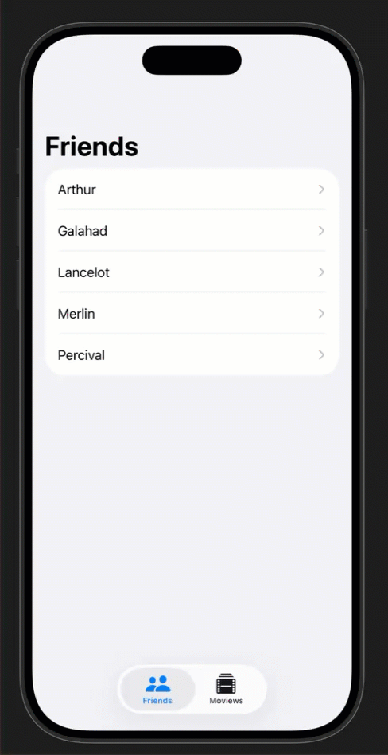

# Friends' Favorite Movies

A SwiftUI app for tracking friends and their favorite movies, built as part of the **Develop in Swift Tutorials** - "Models and persistence" section.

**Tutorial**: [Models and persistence](https://developer.apple.com/tutorials/develop-in-swift/save-data)

## Demo

## Overview

This app demonstrates data modeling and persistence using SwiftData with related models. It allows users to manage a collection of friends and movies, establishing relationships between them to track which movies each friend enjoys.

## Features

- **Friends Tab**: Browse and manage your list of friends
- **Movies Tab**: View and organize your movie collection
- **Data Persistence**: All data is saved using SwiftData and persists between app launches
- **Sample Data**: Includes pre-populated sample data for development and testing

## Technical Details

- Built with **SwiftUI** for the user interface
- Uses **SwiftData** framework for data modeling and persistence
- Implements the `@Model` macro for [`Friend`](FriendsFavoriteMovies/FriendsFavoriteMovies/Models/Friend.swift) and [`Movie`](FriendsFavoriteMovies/FriendsFavoriteMovies/Models/Movie.swift) data models
- Uses `@Query` property wrapper to fetch and sort data
- Features a `TabView` for navigating between friends and movies
- Implements `NavigationSplitView` for master-detail navigation

## Project Structure

- [`FriendsFavoriteMoviesApp.swift`](FriendsFavoriteMovies/FriendsFavoriteMovies/FriendsFavoriteMoviesApp.swift) - App entry point with model container configuration
- [`ContentView.swift`](FriendsFavoriteMovies/FriendsFavoriteMovies/Views/ContentView.swift) - Main view with tab navigation
- [`FriendListView.swift`](FriendsFavoriteMovies/FriendsFavoriteMovies/Views/FriendListView.swift) - View displaying the list of friends
- [`MovieListView.swift`](FriendsFavoriteMovies/FriendsFavoriteMovies/Views/MovieListView.swift) - View displaying the list of movies
- [`Friend.swift`](FriendsFavoriteMovies/FriendsFavoriteMovies/Models/Friend.swift) - SwiftData model representing a friend
- [`Movie.swift`](FriendsFavoriteMovies/FriendsFavoriteMovies/Models/Movie.swift) - SwiftData model representing a movie with title and release date
- [`SampleData.swift`](FriendsFavoriteMovies/FriendsFavoriteMovies/Views/Support/SampleData.swift) - Sample data provider for previews and testing

## Learning Objectives

This project teaches:
- Creating SwiftData models with the `@Model` macro
- Establishing relationships between models
- Querying and sorting data with `@Query`
- Using `NavigationSplitView` for master-detail interfaces
- Implementing tab-based navigation with `TabView`
- Managing in-memory vs. persistent model containers

## Requirements

- iOS 18.0+
- Xcode 16.0+
- Swift 5.0+

## Getting Started

1. Clone the repository
2. Open `FriendsFavoriteMovies.xcodeproj` in Xcode
3. Build and run the project in the simulator or on a device